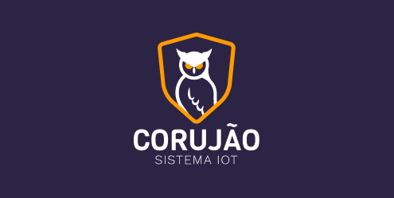

--------------------------------------------------------------------
<h2 align="center">
     
Corujão - Segurança e prevenção nas estradas.
</h2>

## 📖 Corujão IOT

O Corujão IOT é uma solução que inova ao apresentar uma solução de segurança que extrapola as limitações técnicas de cobertura de internet na estrada. A solução traz o caminhoneiro para o protagonismo ao propiciar uma ferramenta para o seu bem estar onde ele está no controle, além de, apresentar um canal que mapeia ações de bandidos e permite a colaboração de informações, criando um senso de comunidade.

### :rocket: Tecnologias Utilizadas

- [Node.JS](https://nodejs.org/en/)
- [React Native](https://reactnative.dev/)
- [HTML](https://developer.mozilla.org/pt-BR/docs/Web/HTML)
- [CSS](https://developer.mozilla.org/pt-BR/docs/Web/CSS)
- [JS](https://developer.mozilla.org/pt-BR/docs/Aprender/JavaScript)

## 🚀 Utilização

<h3>Atualizações</h3>
<ul>
	<li>Backend feito NodeJs, <a href="https://github.com/limaantonio/backend-corujao" target="_blank">Link Repo</a></li>
</ul>

## Protótipo

<a href="https://www.figma.com/file/4bF4sry8ifj63XxWUT3Ce3/Coruj%C3%A3o---Sistema-IoT?node-id=1%3A979">Link do protótipo</a>

## ✍ Autores

👤 **Antonio Carlos Lima**

* Github: [@limaantonio](https://github.com/limaantonio)

## 📝 Licença

Copyright © 2020 Hackathon CCR 

***
